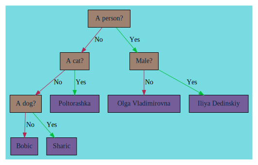

#  Akinator

A console-based implementation of the classic "Akinator" guessing game, written in **C**. The program uses a **binary decision tree** to guess what character, animal, or object the player is thinking of by asking a series of yes/no questions.

>  *Think of something, answer the questions, and let the genie guess!*

---

##  Table of Contents

- [Features](#-features)
- [Visualization](#-visualization)
- [Technologies Used](#-technologies-used)
- [Game Controls](#-game--controls)
- [Building & Running](#-building--running)
- [Data Format](#-data-format)
- [Roadmap](#-roadmap)

---

##  Features

-  **Dynamic Decision Tree**: Questions and answers are stored in a flexible binary tree structure
-  **Interactive Q&A**: Players answer yes/no questions to narrow down possibilities
-  **Persistent Data**: Knowledge base saved to `data.txt` in a human-readable format
-  **Graph Visualization**: Export decision tree to DOT/SVG format using Graphviz
-  **Debug Support**: Built-in debug mode with AddressSanitizer and extensive compiler warnings
-  **Extensible**: Easy to add new questions and characters to the knowledge base

---
##  Visualization

Here's how the decision tree looks:


The decision tree can be visualized using Graphviz:

```bash
# Generate SVG from DOT file
dot -Tsvg Graf.dot -o Graf.svg

# Open in browser
xdg-open Graf.svg  # Linux
open Graf.svg      # macOS
```

The visualization shows:
-  **Question nodes** (internal nodes)
-  **Answer nodes** (leaf nodes)
-  **Yes edges** /  **No edges**

##  Technologies Used

| Technology | Purpose |
|------------|---------|
| **C++17** | Core language with modern features |
| **Graphviz** | Decision tree visualization (`.dot` → `.svg`) |
| **Make** | Build automation |
| **AddressSanitizer** | Memory error detection in debug builds |

---


##  Game Controls

During gameplay, you can use the following single-letter commands:

| Command | Action | Description |
|---------|--------|-------------|
| **`p`** | **Play** | Start a new guessing session. The AI will ask you a series of yes/no questions to determine the character/object you're thinking of. |
| **`s`** | **Show** | Print branch structure from `data.txt` to console |
| **`d`** | **Dump/Debug** | Display the internal decision tree structure (also generates `Graf.dot` and `Graf.svg` for visual inspection). Useful for debugging and understanding how the AI makes decisions. |
| **`q`** | **Quit** | Exit the program gracefully. |

### Example Session
```bash
$ ./akinator
> p          # Start playing
Is your character real? (y/n): y
Does your character appear in movies? (y/n): y
...
It's Ebelex!
```

  **Files**:  
 - `data.txt` — persistent knowledge base  
 - `Graf.dot` / `Graf.svg` — visual representation of the decision tree (Graphviz format)  
 - `Makefile` — build instructions  

---

##  Building & Running

### Prerequisites

- GNU Make
- G++ compiler with C++17 support
- (Optional) Graphviz for visualization: `sudo apt install graphviz`

### Build Commands

```bash
# Build the release version
make akinator

# Run the game
make run

# or directly:
./Akinator data.txt

# Clean build artifacts
make clean
```

---

##  Data Format

The knowledge base (`data.txt`) uses a nested brace syntax:

```
{
 "Question?"
 {
   # No-branch
   "Next question or answer"
 }
 {
   # Yes-branch  
   "Next question or answer"
 }
}
```

### Example:
```
{
 "A person?"
 {
   "A cat?"
   {
     "A dog?"
      {
        "Bobic"
      }      # No → Bobic
      {
        "Sharic"
      }     # Yes → Sharic
   }
   { "Poltorashka" }  # No → Poltorashka
 }
 {
   ...
 }
}
```

---

##  Roadmap
- [ ] Add the opportunity to **teach it** by providing the correct answer and a distinguishing question.
- [ ] Add "don't know" answer


##  Acknowledgements

- Inspired by the original [Akinator](https://en.akinator.com/) game by Elokence
- Decision tree algorithm based on binary search principles [[6]](https://stackoverflow.com/questions/13649646/what-kind-of-algorithm-is-behind-the-akinator-game)
- Built with educational purposes in mind

---


*Made with  by [vanomark](https://github.com/vanomark)*